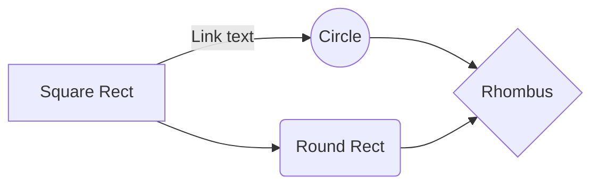

> Written with [StackEdit](https://stackedit.io/).

And this will produce a flow chart:

```mermaid
graph LR
A[Square Rect] -- Link text --> B((Circle))
A --> C(Round Rect)
B --> D{Rhombus}
C --> D
```

<!--stackedit_data:
eyJoaXN0b3J5IjpbLTUwMjE0ODQ5Nl19
-->