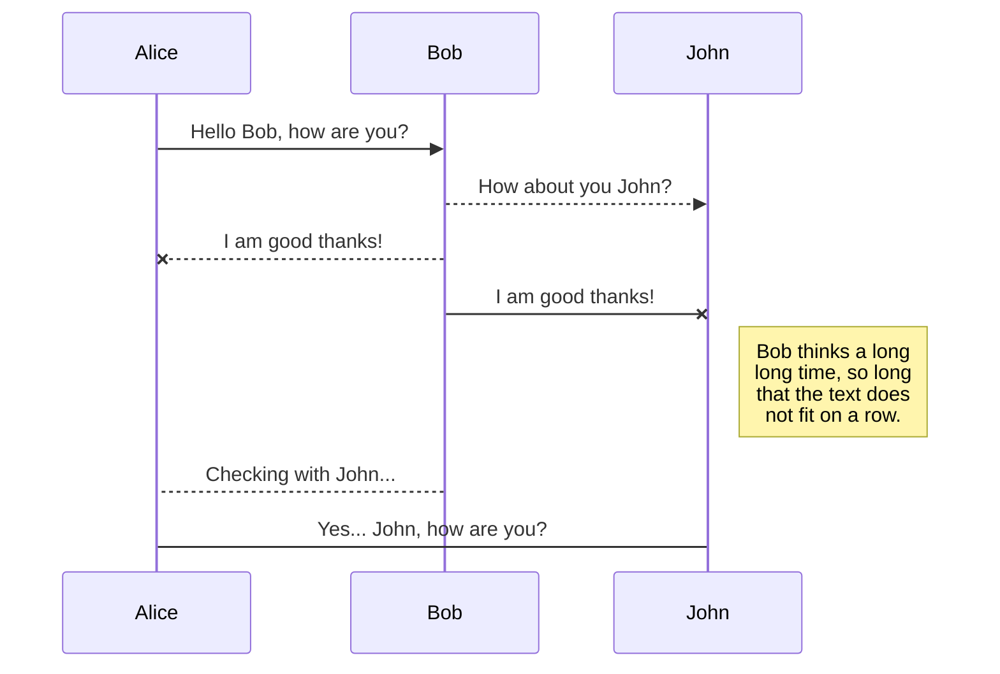
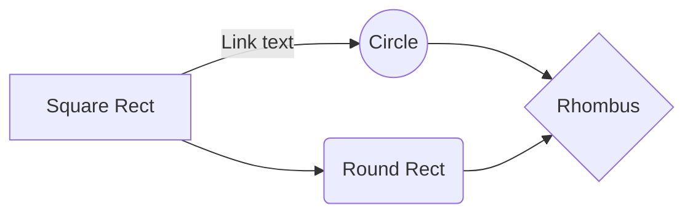

> Written with [StackEdit](https://stackedit.io/).

### How to add a list

# Development

## Milestone Tasks
- [x] Request more data: License by GO for 2007 - 2018 (Maria Kathrina) - on Feb 20
- [x] Request more data: Contracted Agents by GO for 2007 - 2018 (Maria Kathrina) - on Feb 20
- [x] Request more data: ARD by GO for 2007 - 2018 (Vana) - on Feb 20
- [x] Request more data: Prospect Lead by GO for 2007 - 2018 (Robert Smith) - on Feb 20
- [ ] Request more data: waiting for more info about the trigger levels for individual GOs
- [ ] Data: Include State indicator variable

### Strikethrough words or phrases using `~~two tildes~~`

Exmple:

```
~~Visit the [Project Set Up](https://nylgit.newyorklife.com/CDSA/Agent-Licensing/wikis/home) page to know about the location of the data and the project directory on the SAS server.~~
```
Outputs:

~~Visit the [Project Set Up](https://nylgit.newyorklife.com/CDSA/Agent-Licensing/wikis/home) page to know about the location of the data and the project directory on the SAS server.~~

# How to use `mermaid` for flowchart

The best approach is using [Mermaid live editor](https://mermaid-js.github.io/mermaid-live-editor/#/edit/eyJjb2RlIjoiZ3JhcGggVERcbiAgQVtDaHJpc3RtYXNdIC0tPnxHZXQgbW9uZXl8IEIoR28gc2hvcHBpbmcpXG4gIEIgLS0-IEN7TGV0IG1lIHRoaW5rfVxuICBDIC0tPnxPbmV8IERbTGFwdG9wXVxuICBDIC0tPnxUd298IEVbaVBob25lXVxuICBDIC0tPnxUaHJlZXwgRltmYTpmYS1jYXIgQ2FyXVxuXHRcdCIsIm1lcm1haWQiOnsidGhlbWUiOiJkZWZhdWx0In19). You can download an image and then upload the image to GitLab or GitHub. 

- [Guide for mermaid flowcharts](https://mermaid-js.github.io/mermaid/#/flowchart) 

## UML diagrams on Stackedit - Limited application

You can render UML diagrams using [Mermaid](https://mermaidjs.github.io/). For example, this will produce a sequence diagram:



And this will produce a flow chart:




<!--stackedit_data:
eyJoaXN0b3J5IjpbMTE5MjIxNzA1OSwtODU3MDY3NDY1LDc2Mj
UxMzM1NSwzNTY0MjI0MDldfQ==
-->